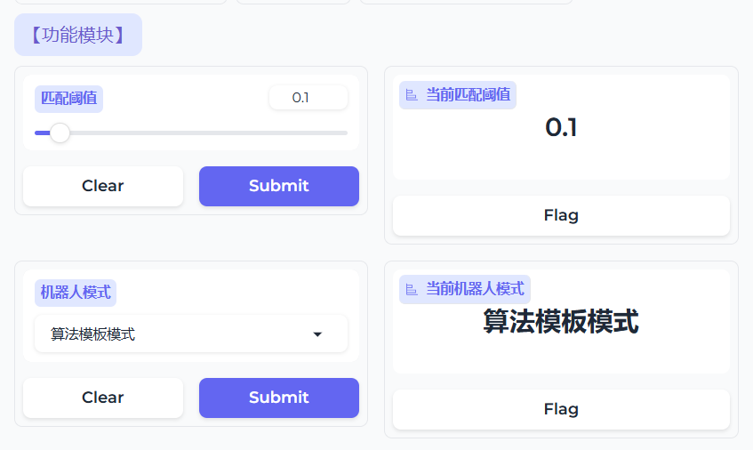
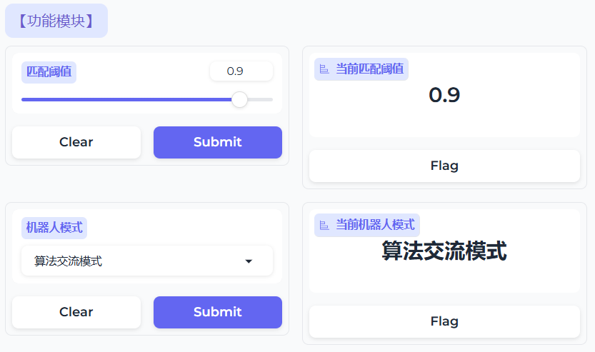
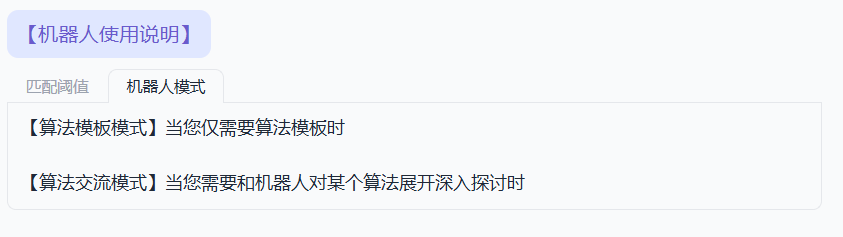
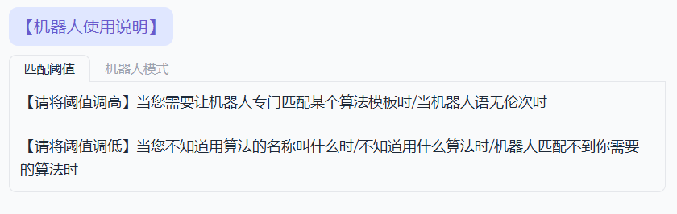

# 传统算法问答模型

## 1 引言

### 1.1 项目介绍

​	传统算法问答模型/Traditional algorithmic question-answering model(TAQAModel)是一个专门为算法竞赛选手提供算法知识的智能交流模型。TAQAModel区别于基础对话大模型(e.g. ChatGpt4, LGM-4) ，它可以提供完全正确的算法模板(e.g. 线段树模板，树上倍增模板)，以及根据正确的模板与用户进行算法知识上的交流。 该项目为算法竞赛选手提供了一个强大的辅助工具，帮助他们更好地理解和应用复杂的算法，提高竞赛成绩。

### 1.2 项目意义

这里引用一下知乎去年用gpt-4辅助参加codeforces中一场比赛的文章：[使用gpt4辅助做Codeforces - 知乎 (zhihu.com)](https://zhuanlan.zhihu.com/p/614608835)。

通过该文章发现,让大模型自己解决算法问题，优化代码时间复杂度，目前看来是不实际的。但是如果让大模型辅助选手、程序员去解决算法问题是可以做到的。

作为大学期间参加程序设计大赛(acm/icpc)的一名选手, 我深知在解决算法题时找不到相应算法模板，即使找到算法模板，当前大模型给出的算法代码正确性不能得到保证，这些难处。所以借此机会做了一个关于算法问答的模型。根据一名算法竞赛选手的要求，如果该模型可以做到以下几点，这个项目就有存在的意义。

- 提供的算法模板非常精准
- 提供的算法模板注释齐全，解释清楚明了
- 可以根据选手提出的问题智能找到可以解决该问题算法
- 不仅仅可以提供算法模板，还可以与模型交流，学到拓展知识。

这次项目也基本做到上述4点功能，对于我来说它是能拿来使用的，可以帮助我解决算法问题的。

### 1.3 项目特性

- [x] 采用 Langchain 作为核心框架，充分利用其模块化和可扩展的特点，确保系统可以灵活地适应不同的算法问答需求。
- [x] 采用了Sqlite3轻量级关系型数据库, FAISS向量数据库相互结合的方法，既做到了持久化存储，节省token，又做到了提升模型的准确性和响应速度。
- [x]  通过 Loguru 进行日志管理，确保在开发和运行过程中可以高效地记录和追踪系统的状态和问题。
- [x] 通过 YAML 文件参数灵活配置。
- [x] 使用 Gradio实现图形用户界面 (GUI) 以便更易于使用，同时灵活使用Gradio中Block组件以及更改相关css，美化了界面
- [x]  通过Gradio, 创建一个网络服务或 API，以便在网络应用中使用。
- [x] 模块化和面向对象的设计，易于定制和扩展。
- [x] 支持 ChatGLM 和 OpenAI 模型。
- [x] 文本中去除噪音, 使模型更容易捕捉到有意义的模式和关系。

### 1.4 开发环境

```
python                                   3.11.5
langchain                                0.2.0
langchain-community                      0.2.6
langchain-core                           0.2.12
langchain-openai                         0.1.14
langchain-text-splitters                 0.2.2
faiss-cpu                                1.8.0.post1
gradio                                   4.37.2
pandas                                   2.0.3
numpy                                    1.24.3
loguru                                   0.7.2
sentence-transformers                    2.3.0
Jinja2                                   3.1.2
```


## 2 项目设计

### 2.1 系统流程图

#### 算法模板模式流程图


#### 算法交流模式流程图


### 2.2 系统模块分析

#### 2.2.1 知识库模块

 	                                                  

算法知识库分为算法名称，算法代码模板，算法描述。算法名称，算法代码模板存入关系型数据库中, 算法描述存入向量数据库中。


#### 2.2.2 用户描述分析模块


通过Embedding和向量数据库将用户描述，近似检索出最相似的一条算法描述并输出。

#### 2.2.3 描述-名称模糊映射模块


给予chain1中Model合适的prompt， 通过chian2，将算法描述映射为算法模糊名称并输出

#### 2.2.4 模糊名称-数据库id映射模块


给予chain2中Model合适的prompt， 通过chain2，将模糊的算法名称映射为真实算法名称对应数据库表中的id并输出

#### 2.2.5 关系型数据库查询模块


使用id, 通过关系型数据库查到算法代码模板

#### 2.2.6 代码分析注释模块


给予chain3中Model合适的prompt， 通过chain3，分析算法代码模板，并输出。同时为了节省tokens，将获得的结果存到memory中，从memory中持久化存储到关系型数据库中。

#### 2.2.7 算法交流模板


给予chain4中Model合适的prompt同时将Memory中之间的对话作为prompt， 通过chain4，用户可以与TAQAModel进行对话交流。

### 2.3 遇到的关键问题与解决方法

```
1. 算法模板匹配不准确。用户忘记算法名称，通过对算法的描述不能找到相关算法模板

   解决方法：知识库中，在仅有算法模板的基础上添加该算法的详细描述

2. 算法详细描述 + 算法模板的token太大，超出Embedding模型最大token数

   解决方法1：将算法模板与算法详细描述分开存在关系型数据库和向量数据库中。

   解决方法2：采用BAAI/bge-small-zh-v1.5模型（一开始采用的是Qianfan模型中的Embeddingv1）

3. 基础大模型通过算法描述得到的算法名称不稳定，导致在关系型数据库中通过算法名称为key查找算法代码时会出错

   解决方法：串联两个chain, 通过两次大模型的纠正，得到关系型数据库中算法名称对应的id，进而精准的找到算法模板

4. 当TAQAModel切换到算法交流模式时，没有之前记忆难以交流

   解决方法：将之前的对话结果存到Memory(history)中，当切换为算法交流模式时，将memory中的内容作为prompt提供给chain
```


## 3 项目实现

### 3.1 前端图形化界面

```python
import os
import gradio as gr

from utils import LOG
from utils import ChatBotConfig
from utils import NoiseRemoval
from chatbot import ChatBot
from sql import DataTODB

def init(): 
    dir_path = os.path.dirname(os.path.abspath(__file__))
    config = ChatBotConfig()
    config.init(dir_path=dir_path)
    global chatbot, noiseremoval, db
    db = DataTODB()

    chatbot = ChatBot(config.model_name, config.api_key, config.base_url) 
    noiseremoval = NoiseRemoval()

    global slider_value_now, bot_model_now
    slider_value_now = 0.1
    bot_model_now = "算法模板模式"

def get_slider_value(slider_value):
    global slider_value_now
    slider_value_now = slider_value
    LOG.debug(f"[slider_value_now]{slider_value_now}")
    return slider_value

def get_bot_model(bot_model):
    global bot_model_now
    bot_model_now = bot_model
    LOG.debug(f"[bot_model_now]{bot_model_now}")
    return bot_model

def algorithm_chat(message, history):
    try:
        LOG.debug(f"[message]{message}")
        LOG.debug(f"[history]{history}")
        LOG.debug(f"[slider_value_now]{slider_value_now}")
        LOG.debug(f"[bot_model_now]{bot_model_now}")

        processed_message = noiseremoval.Do_NoiseRemoval(message)
        LOG.debug(f"[message after noise removal]{processed_message}")

        if bot_model_now == "算法模板模式":
            result, statue, id = chatbot.CodeAnalysis(processed_message, slider_value_now)

            if statue == 1:
                LOG.debug(f"[result]{result}\n[statue]{statue}\n[id]{id}")
                flag = db.Result_Online_ToDB_By_ID(id, result)
                if flag:
                    LOG.debug("Insert successful")
                else:
                    LOG.error("Insert failed")

            return result
    
        else:
            return chatbot.AlgorithmExchange(processed_message, history)
    
    except Exception as e:
        LOG.error(f"Error invoking retrieval chain: {e}")
        return "An error occurred. Please try again."

def launch_gradio():
    slider = gr.Slider(minimum=0.05, maximum=1, step=0.05, value=0.1, label="匹配阈值")
    bot_model = gr.Dropdown(choices=["算法模板模式", "算法交流模式"], label="机器人模式", value="算法模板模式")
    slider_output = gr.Label(label="当前匹配阈值", value=0.1)
    bot_model_output = gr.Label(label="当前机器人模式", value="算法模板模式")
    # 创建 ChatInterface 实例
    with gr.ChatInterface(
        fn=algorithm_chat,
        title="算法模板机器人(比赛ak机器人)",
        chatbot=gr.Chatbot(height=800),
        retry_btn=None,
        undo_btn=None,
        clear_btn=None,
        theme="soft",
        examples=["可以区间查询，区间修改的算法", "线段树区间查询", "可以快速判断字符串是否为子串"],
        css="""
        .gradio-container {
            border: 4px solid #A0C4FF;  /* 更浅的外边框 */
            border-radius: 15px;  /* 更大的圆角边框 */
            padding: 30px;  /* 内边距 */
        }
        """
    ) as chat:
            with gr.Row():
                with gr.Column():
                    txt1 = gr.Markdown(
                        """
                        <span style='color: #6A5ACD; font-size: 18px; background-color: #E0E7FF; padding: 10px; border-radius: 10px;'>【功能模块】</span>
                        """)
                    gr.Interface(fn=get_slider_value, inputs=slider, outputs=slider_output)
                    gr.Interface(fn=get_bot_model, inputs=bot_model, outputs=bot_model_output)
                with gr.Column():
                    txt1 = gr.Markdown(
                        """
                        <span style='color: #6A5ACD; font-size: 18px; background-color: #E0E7FF; padding: 10px; border-radius: 10px;'>【机器人使用说明】</span>
                        """)
                    with gr.Tab(label="匹配阈值"):
                        txt2 = gr.Markdown(
                            """
                            <span style='font-size: 16px;'>【请将阈值调高】当您需要让机器人专门匹配某个算法模板时/当机器人语无伦次时</span><br><br>
                            <span style='font-size: 16px;'>【请将阈值调低】当您不知道用算法的名称叫什么时/不知道用什么算法时/机器人匹配不到你需要的算法时</span>
                            """)
                    with gr.Tab(label="机器人模式"):
                        txt3 = gr.Markdown(
                            """
                            <span style='font-size: 16px;'>【算法模板模式】当您仅需要算法模板时</span><br><br>
                            <span style='font-size: 16px;'>【算法交流模式】当您需要和机器人对某个算法展开深入探讨时</span>
                            """)

# 启动聊天接口
    user_info = [
        ("admin", "123456"),
    ]

    chat.launch(
        share = True,
        server_port=9090,
        debug=False,
        auth=user_info,
        auth_message='欢迎登录大模型演示平台！'
    )

if __name__ == "__main__":
    init()
    launch_gradio()

```

### 3.2 四个核心chain

#### 3.2.1 chain1 : retrieval_chain

用户描述  ——>   向量数据库中最相似算法描述  ——> 算法模糊名称

```python
    from langchain_community.embeddings import HuggingFaceBgeEmbeddings
    from langchain_openai import ChatOpenAI
    from langchain_community.vectorstores import FAISS
    from langchain.text_splitter import CharacterTextSplitter
    from langchain.document_loaders import TextLoader
    from langchain.chains.retrieval import create_retrieval_chain
    from langchain.chains.combine_documents import create_stuff_documents_chain
    from langchain_core.prompts import(
        SystemMessagePromptTemplate,
        HumanMessagePromptTemplate,
        ChatPromptTemplate,
    )
    from utils import LOG, get_data_file_path
    from sql.data_to_db import DataTODB
    import os

    class AlgorithmDescription:
        def __init__(self, model_name : str, api_key : str, base_url : str):
            try:    
                algorithm_describe_faiss_path = get_data_file_path("algorithms_describe")
                algorithm_describe_text_path = get_data_file_path("algorithm_describe")
                embeddings = HuggingFaceBgeEmbeddings(
                    model_name="BAAI/bge-small-zh-v1.5",
                    model_kwargs={"device": "cpu"},
                    encode_kwargs={"normalize_embeddings": True}
                )

                chatmodel = ChatOpenAI(
                    model = model_name,
                    api_key = api_key,
                    base_url = base_url
                )
                self.chatmodel = chatmodel

                if os.path.exists(algorithm_describe_faiss_path):
                    # 加载FAISS数据库
                    db = FAISS.load_local(algorithm_describe_faiss_path, embeddings, allow_dangerous_deserialization=True)
                else:
                    datatodb = DataTODB()
                    db = datatodb.Describe_LocalToDB(algorithm_describe_text_path)
                self.db = db
            except Exception as e:
                LOG.error(f"Initialization failed: {e}")
                raise

        def GetAlgorithmChaoName(self, input : str, score_threshold : int):
            try:
                retriever = self.db.as_retriever(
                    search_type = "similarity_score_threshold",
                    search_kwargs = {"score_threshold" : score_threshold, "k" : 1},

                )
                    
                system_template = (
                    """
                    你是国际信息学奥林匹克竞赛冠军,并且也是国际大学生程序设计大赛ICPC-WF冠军。
                    以检索到的内容中'[回答]'的下一行中()中的内容作为你的输出!!
                    使用以下检索到的内容来回答问题。
                    {context}
                    """
                )
                system_prompt = SystemMessagePromptTemplate.from_template(system_template)

                human_template = ("{input}")
                human_prompt1 = HumanMessagePromptTemplate.from_template(human_template)

                prompt = ChatPromptTemplate.from_messages([system_prompt, human_prompt1])

                chain = create_stuff_documents_chain(self.chatmodel, prompt)

                retrieval_chain = create_retrieval_chain(retriever=retriever, combine_docs_chain=chain)
                result = retrieval_chain.invoke({'input' : input})
                LOG.debug(f"[context]{result['context']}")
                return result['answer'], True
            except Exception as e:
                LOG.error(f"Retrieval failed: {e}")
                return "An error occurred during retrieval", False

            

            
```

#### 3.2.2 chain2 : LLMchain

 算法模糊名称  ——> 算法名称在数据库中对应的id ——> 通过数据库以及id找到代码模板

```python
from langchain_openai import ChatOpenAI
from sql.mysql import SQLite
from chatbot.algorithm_describe import AlgorithmDescription
from langchain.chains import LLMChain
from langchain_core.prompts import(
    SystemMessagePromptTemplate,
    HumanMessagePromptTemplate,
    ChatPromptTemplate,
)

from utils import LOG

class AlgorithmCode:
    def __init__(self, model_name : str, api_key : str, base_url : str):
        try:
            chatmodel = ChatOpenAI(
                model = model_name,
                api_key = api_key,
                base_url = base_url
            )
            self.chatmodel = chatmodel

            sqlite = SQLite()
            self.sqlite = sqlite

            algorithm__list = sqlite.Select_All_Data()

            name_list_prompt = """
你是国际信息学奥林匹克竞赛冠军,并且也是国际大学生程序设计大赛ICPC-WF冠军。
你将获得一段关于某个算法的大致描述。
请你在以下关键词中选取最相关的一个对应的序号整数作为输出:
"""
            for row in algorithm__list:
                name_list_prompt += row[1] + ":" + str(row[0]) + '\n'

            LOG.debug(f'[name_list_prompt]{name_list_prompt}')

            self.name_list_promt = name_list_prompt

            algorithm_description = AlgorithmDescription(model_name, api_key, base_url)
            self.algorithm_description = algorithm_description
        except Exception as e:
            LOG.error(f"Initialization failed: {e}")
            raise
    
    def GetAlgorithmCode(self, input : str, score_threshold : int):
        try:
            algorithm_chao_name, statue = self.algorithm_description.GetAlgorithmChaoName(input, score_threshold)
            LOG.debug(f"[algorithm_chao_name]{algorithm_chao_name}")
            if not statue:
                return algorithm_chao_name, statue
            
            system_template = (self.name_list_promt)
            system_prompt = SystemMessagePromptTemplate.from_template(system_template)

            human_template1 = ("请您仅输出序号整数!!!\n以下是我的输入:\n{input}")
            human_prompt1 = HumanMessagePromptTemplate.from_template(human_template1)

            prompt = ChatPromptTemplate.from_messages([system_prompt, human_prompt1])

            chain = LLMChain(llm = self.chatmodel, prompt = prompt)

            algorithm_id = chain.invoke({'input' : algorithm_chao_name})['text']
            LOG.debug(f"[algorithm_id]{algorithm_id}")
            
            result, flag = self.sqlite.Select_Data_By_Id(algorithm_id)

            if flag == 2:
                LOG.debug(f"[algorithm_code : Algorithm analysis results already exist]{result}")
            elif flag == 0:
                result = "知识库中无该算法模板"
                LOG.error(f'[algorithm_code :]{result}')
            else:
                LOG.debug(f"[algorithm_code : The algorithm analysis result does not exist, and the return code]{result}")

            return result, flag, algorithm_id
        
        except Exception as e:
            LOG.error(f"Retrieval failed: {e}")
            return "An error occurred during retrieval", 0
```

#### 3.2.3 chain3 : LLMchain

 代码模板  ——> 带有注释以及分析的代码模板

```python
def CodeAnalysis(self, input : str, score_threshold : int):
        try:
            chain = LLMChain(llm = self.chatmodel, prompt = self.prompt_analysis)
            code, statue, id = self.algorithmcode.GetAlgorithmCode(input, score_threshold)
            LOG.debug(f"chatbot:\n[code]{code}\n[statue]{statue}\n[id]{id}")
            result = code
            if statue == 1:#获取代码，通过大模型分析代码
                result = chain.invoke({'input' : code})['text']
                LOG.debug(f"[chatbot : Algorithm analysis results already exist]{result}")
            elif statue == 2:#数据库中已经存在分析代码，直接输出
                LOG.debug(f"[chatbot : The algorithm analysis result does not exist, analyze through code]{result}")

            return result, statue, id
        
        except Exception as e:
            LOG.error(f"chatbot : Retrieval failed: {e}")
            return "An error occurred during retrieval"
```


#### 3.2.4 chain4: LLMchain

 历史对话作为prompt，与TAQAModel进行算法交流

```python
    def AlgorithmExchange(self, input : str, history : list):
        try:
            prompt_list = [self.system_prompt2]
            LOG.debug(f"[history len]{len(history)}")
            if len(history) > 0:
                LOG.debug(f"[history message]{history[0][0]}")
                human_template0 = (self.escape_braces(history[0][0]))
                LOG.debug(f"[history message]{ human_template0}")
                human_prompt0 = HumanMessagePromptTemplate.from_template(human_template0)
                prompt_list.append(human_prompt0)
                LOG.debug(f"[history_human]{human_prompt0}")

                LOG.debug(f"[history return]{history[0][1]}")
                ai_template0 = (self.escape_braces(history[0][1]))
                ai_prompt0 = AIMessagePromptTemplate.from_template(ai_template0)
                prompt_list.append(ai_prompt0)
                LOG.debug(f"[history_ai]{ai_prompt0}")
            
            prompt_list.append(self.human_prompt1)
            prompt_exchange = ChatPromptTemplate.from_messages(prompt_list)
            chain = LLMChain(llm = self.chatmodel, prompt = prompt_exchange)
            result = chain.invoke({'input' : input})['text']
            return result
        
        except Exception as e:
            LOG.error(f"chatbot : Retrieval failed: {e}")
            return "An error occurred during retrieval"
```


### 3.3 数据库操作集成

```python
import sqlite3
import os
from utils import LOG, get_data_file_path
from typing import Tuple, List
from langchain.text_splitter import CharacterTextSplitter
from langchain.document_loaders import TextLoader

class SQLite:
    def __init__(self):
        db_path = get_data_file_path("algorithms_code.db")
        exist_db = True
        if not os.path.exists(db_path):
            exist_db = False

        conn = sqlite3.connect(db_path, check_same_thread=False)

        cursor = conn.cursor()

        if exist_db == False:
            cursor.execute("""
            CREATE TABLE IF NOT EXISTS algorithms (
                id INTEGER PRIMARY KEY AUTOINCREMENT,
                name TEXT NOT NULL,
                code TEXT NOT NULL,
                result TEXT
            )
            """)
            LOG.debug("建立表成功")
            conn.commit()
            self.conn = conn
            self.cursor = cursor

            loader = TextLoader(get_data_file_path("algorithm.txt"), encoding="UTF-8")
            document = loader.load()

            text_splitter = CharacterTextSplitter(
                    separator = r'\n\n-----\d+-----',
                    chunk_size=300,
                    chunk_overlap=0,
                    length_function = len,
                    is_separator_regex = True
                )
            
            docs = text_splitter.split_documents(document)
            for doc in docs:
                text = doc.page_content
                lines = text.strip().split('\n')
                current_section = None

                for line in lines:
                    line = line.strip()
                    if line == "[算法名称]":
                        current_section = "算法名称"
                        algorithm_name = ""
                    elif line == "[算法代码]":
                        current_section = "算法代码"
                        algorithm_code = ""
                    elif current_section == "算法名称":
                        algorithm_name += line + "\n"
                    elif current_section == "算法代码":
                        algorithm_code += line + "\n"

                algorithm_name = algorithm_name.strip()
                algorithm_code = algorithm_code.strip()
                LOG.debug(f'[algorithm_name]{algorithm_name}')
                LOG.debug(f'[algorithm_code]{algorithm_code}')
                statue = True
                statue |= self.Insert_Data_name_and_id(algorithm_name, algorithm_code)
        self.conn = conn
        self.cursor = cursor


    def Select_Data_By_Name(self, algorithm_name : str) -> Tuple[str, bool]:
        self.cursor.execute("SELECT * FROM algorithms WHERE name = ?", (algorithm_name,))
        existing_rows = self.cursor.fetchall()
        if existing_rows:
            return existing_rows[0][2], True
        else:
            return None, False

    def Select_Data_By_Id(self, algorithm_id : int) -> Tuple[str, int]:
        self.cursor.execute("SELECT * FROM algorithms WHERE id = ?", (algorithm_id,))
        existing_rows = self.cursor.fetchall()
        if existing_rows:
            if len(existing_rows[0]) > 3 and existing_rows[0][3] is not None:
                return existing_rows[0][3], 2
            elif len(existing_rows[0]) > 2:
                return existing_rows[0][2], 1
            return None, 0
        else:
            return None, 0       

    def Insert_Data_name_and_id(self, algorithm_name : str, algorithm_code : str):
        LOG.debug(f"[Insert_name]{algorithm_name} \n [Insert_code]{algorithm_code}")
        code, statue = self.Select_Data_By_Name(algorithm_name)
        if statue:
            return False
        else:
            sql = "INSERT INTO algorithms (name, code) VALUES (?, ?)"
            val = (algorithm_name, algorithm_code)
            self.cursor.execute(sql, val)
            self.conn.commit()
            return True

    def Insert_Date_result_By_ID(self, algorithm_id : int, result : str):
        code, statue = self.Select_Data_By_Id(algorithm_id)
        if statue == 1:
            self.cursor.execute("""
            UPDATE algorithms
            SET result = ?
            WHERE id = ?
            """, (result, algorithm_id))
            
            self.conn.commit()
            return True
        else:
            return False

    def Select_All_Data(self):  # 定义一个方法，用于查询所有算法数据，返回所有记录
        self.cursor.execute("SELECT * FROM algorithms") 
        all_rows = self.cursor.fetchall()
        return all_rows  

    def close(self):
        self.cursor.close()
        self.conn.close()

```

### 3.4 utils——工具箱

#### 3.4.1 日志管理

```python
from loguru import logger
import os
import sys

class Logger:
    def __init__(self, log_dir = "logs"):
        if not os.path.exists(log_dir):
            os.makedirs(log_dir)

        log_file_path = os.path.join(log_dir, "algorithm_chatbot.log")
        logger.remove()
        
        logger.add(sys.stdout, level="DEBUG")
        logger.add(log_file_path, rotation="02:00", level="DEBUG")
        self.logger = logger

LOG = Logger().logger

if __name__ == "__main__":
    log = Logger().logger

    log.debug("This is a debug message.")
    log.info("This is an info message.")
    log.warning("This is a warning message.")
    log.error("This is an error message.")


```


#### 3.4.2 YAML 文件参数配置管理

```python
import yaml
import os

class ChatBotConfig:

    _instance = None

    def __new__(cls):
        if cls._instance is None:
            cls._instance = super(ChatBotConfig, cls).__new__(cls)
            cls._instance._config = None
        return cls._instance
    
    def init(self, dir_path):
        with open(os.path.join(dir_path, "config.yaml"), "r") as f:
            config = yaml.safe_load(f)

        self._instance._config = config

    def __getattr__(self, name):
        if self._instance._config and name in self._instance._config:
            return self._instance._config[name]
        raise AttributeError(f"ChatBotConfig 对象没有属性'{name}'")
```


#### 3.4.3 文本去除噪音

```python
import re
import jieba
from utils.data_path import get_data_file_path
class NoiseRemoval:
    def __init__(self):
        with open(get_data_file_path("stopwords.txt"), 'r', encoding="UTF-8") as f:
            stop_words = set(word.strip() for word in f if word.strip())
        self.stop_words = stop_words

    def Do_NoiseRemoval(self, text : str):
        text = re.sub(r'[^\w\s]', '', text)
        text = re.sub(r'\s+', ' ', text).strip()
        words = jieba.lcut(text)
        filtered_words = [word for word in words if word not in self.stop_words]
        return ''.join(filtered_words)


```


## 4 界面展示

### 4.1 登录界面


### 4.2 用户界面

#### 4.2.1 页面


#### 4.2.2 功能模块





#### 4.2.3 机器人使用说明





### 4.3 算法模式

#### 4.3.1 演示1


#### 4.3.2 演示2


